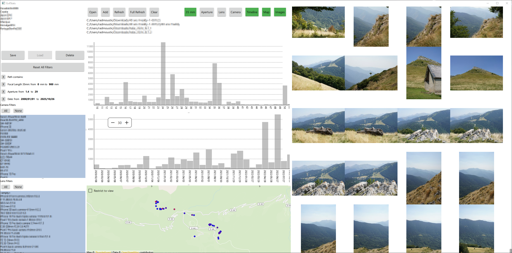

# ExifStats
Exif statistics of your JPEG and HEIF library



## Usage
* **Open** or **Add** a folder containing **JPEG** or **HEIF** images. It will read all files (including sub folders) and extract the EXIF data.
* You can use the **Refresh** button to find new files without reparsing all the files already there or the **Full Refresh** to reparse all files.
* You can right click on a camera in the list on the left penel to set a 35mm equivalent focal factor if the camera does not add it automatically to the EXIF
* You can zoom with the mouse wheel in all charts, use Ctrl + Wheel to zoom vertically, or Double Click to reset the view
* You can click on a bar in a chart to get the value
* You can right click on a bar chart to set the from/to filters
* You can use the Ctrl + Wheel on the image grid to zoon
* You can use Ctrl + Double Click on the image grid to reset the zoom
* You can Double Click on an image in the image grid to open it with the default image viewer
* You can use the **Restrict to View** option of the map to filter out files not in the actual map view
* You can click on the map to see the images around the clicked position (if you want to reset the click in an empty space)
* All files (database, presets, logs and image cache are stored in **%localappdata%/ExifStats/ExifStats**
* All settings are stored in **HKEY_CURRENT_USER\SOFTWARE\ExifStats\ExifStats**

## Customize UI / QML

Download and extract the CustomizeQML.zip into the same directory as ExifStats.exe. Restart ExifStats.exe and it should load the QML from the Qml directory instead of the embedded one. It supports hot reload and all errors and warnings are logged into a file located in **%localappdata%\ExifStats\ExifStats\ExifStats.log**

## Compilation

### Windows
* Requirements
  * Visual Studio 2022+
  * CMake 3.6.2+
  * Download and install Qt6.6+ https://doc.qt.io/qt-6/get-and-install-qt.html
    * MSVC 2019 64-bit
    * Sources
    * Qt 5 Compatibility Module
    * Qt Debug Information Files
    * Additional librairies:
      * Qt Image Formats
      * Qt Location
* Create a file **User.Setup.bat** at the root next to **CMakeLists.txt** with:
```
set QT_ROOT_DIR=c:\Dev\Qt
REM (optional) set QT_VERSION=6.6.2 => Project.Setup.bat already set a default value
REM (optional) set QT_MSVC_DIR=msvc2019_64 => Project.Setup.bat already set a default value
REM (optional) set HEIF_PLUGIN_ENABLE=true => See Heif / Turbojpeg plugins section
REM (optional) set TURBOJPEG_PLUGIN_ENABLE=true => See Heif / Turbojpeg plugins section
```
* Use a bat in the Scripts folder:

The binaries and all generated files are located in the **generated** folder

| Script | Description | Requirements |
| --- | --- | --- |
| Scripts/CMake.bat | CMake only |  |
| Scripts/Build.bat | Build release only | CMake |
| Scripts/Deploy.bat | Deploy files required to launch the debug/release/relwithdebuginfo binaries (dlls, qml ...) | Build |
| Scripts/Run.bat | Run the release bin | Build, Deploy |
| Scripts/DeleteGenerated.bat | Delete the Generated folder and all its content |  |
| Scripts/OpenSln.bat | Open the Visual Studio solution | CMake |
| Scripts/OpenQtCreator.bat | Open Qt Creator with the folder (Qt Creator is not officially supported) |  |
| Scripts/BuildDeployRun.bat | Build, Deploy, Run (Release) | CMake |
| Scripts/CleanBuildDebugDeployOpenSln.bat | Delete Generated, CMake, Build, Deploy, Open Sln (Debug) |  |
| Scripts/CleanBuildRun.bat | Delete Generated, CMake, Build, Run (Release) |  |

### Other
Not supported. With a bit of work it should compile on all platforms supported by Qt.

### Setup Image Tagger
Tokenizer is a rust library. You need to install rust.
  
## Static Compilation
### Compile Qt6
First you need to download and compile Qt in Static, if you don't want to use the turbo jpeg lib remove "-no-libjpeg"
```
call "C:\Program Files\Microsoft Visual Studio\2022\Community\Common7\Tools\VsDevCmd.bat"
call "C:\Program Files\Microsoft Visual Studio\2022\Community\VC\Auxiliary\Build\vcvars64.bat"
cd /d "C:\Dev\Qt\6.6.1\Src"
call configure.bat -prefix BuildStatic -static -static-runtime -no-libjpeg -release
cmake --build . --clean-first
cmake --install .
```
This will build Qt in release only and install it in "C:\Dev\Qt\6.6.1\Src\BuildStatic"

### Static Compilation Troubleshot
* tokenizers_c.lib LNK2001 __imp_strcat_s 
Open/create the file "%USERPROFILE%\.cargo\config.toml" and add:
```
[target.x86_64-pc-windows-msvc]
rustflags = ["-C", "target-feature=+crt-static"]

[target.i686-pc-windows-msvc]
rustflags = ["-C", "target-feature=+crt-static"]
```

### Setup ExifStats
Then you need to set the following env var in User.Setup.bat or Project.Setup.bat:
```
set QT_STATIC_DIR=Src\BuildStatic
set QT_STATIC=true
```

## Heif / Turbojpeg plugins
### VCPKG / libheif / libjpeg-turbo
If you want to use the Heif and Turbojpeg plugins, you will need to setup vcpkg and install the libheif and turbojpeg libs:
```
git clone https://github.com/microsoft/vcpkg.git
cd vcpkg
bootstrap-vcpkg.bat
vcpkg install libheif:x64-windows
vcpkg install libheif:x64-windows-static
vcpkg install libjpeg-turbo:x64-windows
vcpkg install libjpeg-turbo:x64-windows-static
```
### Setup ExifStats to use the plugins
Then set the some vcpkg var in the User.Setup.bat:
```
set VCPKG_ROOT_DIR=C:/Dev/vcpkg
set VCPKG_TARGET_TRIPLET=x64-windows
	or
set VCPKG_TARGET_TRIPLET=x64-windows-static
set HEIF_PLUGIN_ENABLE=true
set TURBOJPEG_PLUGIN_ENABLE=true
```
